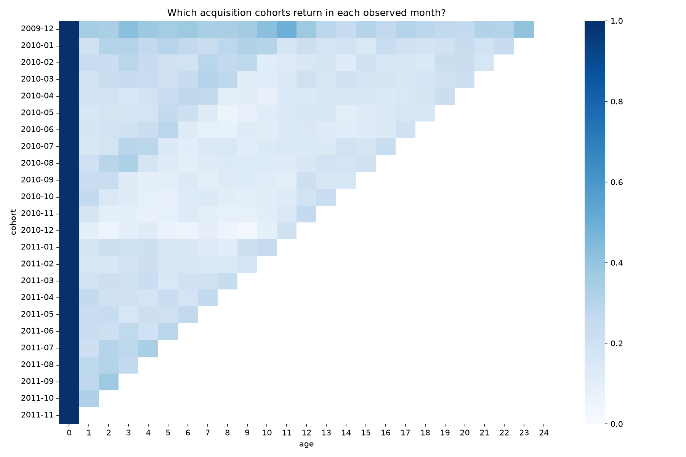
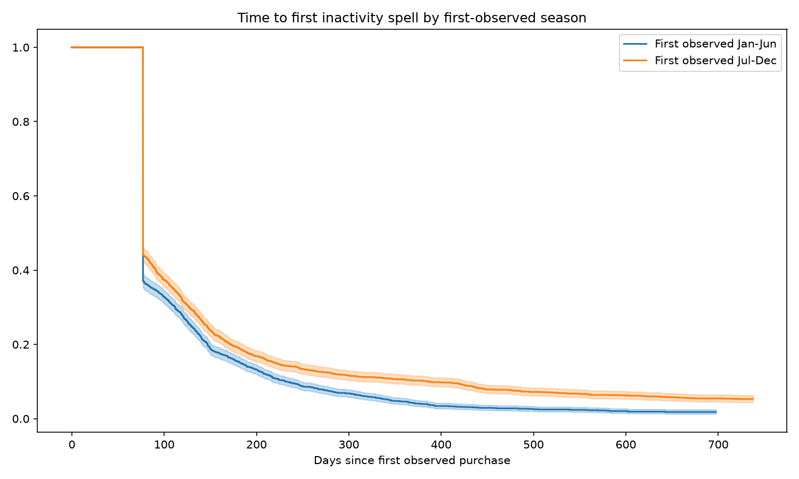
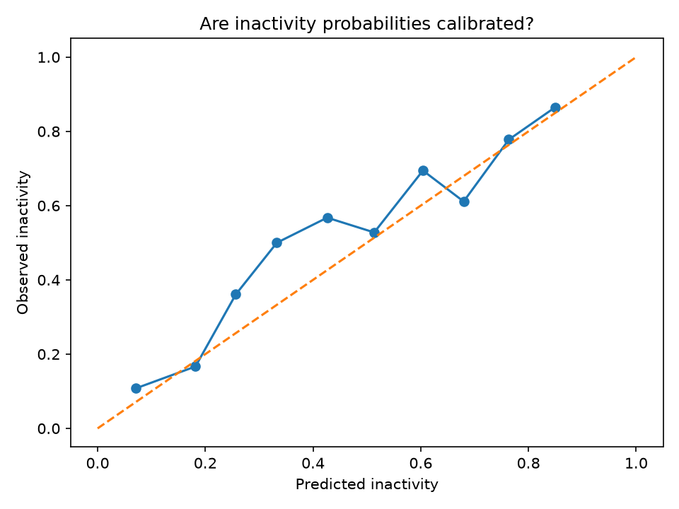

# Customer Lifetime Value, Churn & Retention Optimization

## Executive Summary

This project turns transaction histories into a ranked retention worklist. It asks who is likely to stop purchasing, how much future gross value they represent, and whether contacting them is worthwhile under explicit budget assumptions. It uses 5,878 observed retail customers as a transferable analytics case study, with no claim of banking-data validation.

## Business Problem

Results are generated from `artifacts/tables/results.json`. Monetary amounts are GBP. Observed gross purchases exclude cancellations, returns, nonpositive prices and missing customer identifiers. No experimental intervention response, banking balances, margin or acquisition costs are available.

The prediction estimand is no valid purchase during the next 77 days among customers whose recency is below 77 days at the scoring cutoff. This is operational forward inactivity, not confirmed permanent churn. Survival measures time to the first completed 77-day gap; a customer can later revive. These related estimands are not identical.


## Dataset

UCI Online Retail II: 1,067,371 × 8 raw workbook dimensions; 779,425 valid lines and 36,969 customer invoices. [Source and dictionary](docs/data_dictionary.md).

## Churn Definition

77-day no-purchase prediction among customers with recency below 77. Threshold uses the pre-training 90th-percentile repeat gap rounded to weeks. Holdout inactivity 51.7906%. [Windows and sensitivity](reports/02_churn_definition.md).

## Customer Analytics

Top 20% observed customers contribute 77.2485% of gross positive purchase revenue. Monthly health, geography and customer distributions are saved as CSV. No forced 80/20 claim.

## Cohort Retention

Monthly cohort activity divides active unique customers by first-observed cohort size. Unobserved ages are blank; zero means observed inactivity. Final partial month is excluded. 

## Statistical Analysis

Mann-Whitney U=8100.0000, p=6.37896e-17, rank-biserial=-0.5076. [Assumptions, confidence intervals and business interpretation](reports/03_statistical_analysis.md).

## Survival Analysis

[Kaplan-Meier methodology](reports/04_survival_analysis.md). 

## Churn Prediction

Selected logistic by validation Brier; holdout ROC-AUC=0.7603, average precision=0.7543, Brier=0.2020, precision=0.7059, recall=0.6383, F1=0.6704. [Model card](reports/model_card.md). 

## CLV

BG/NBD + Gamma-Gamma estimates 77-day gross future revenue; holdout forecast total GBP 227263.29, observed GBP 167977.61, MAE GBP 420.38; heuristic MAE GBP 744.91. [Assumptions and diagnostic](reports/05_clv_analysis.md).

## Retention Prioritization

Median value/risk splits create four profiles; risk × value ranks economic exposure. This is a proxy and not a treatment-effect model.

## Business Simulation

[Scenario comparisons](reports/06_retention_simulation.md) sweep effectiveness, contact costs, incentives and capacity. Negative scenario contribution means the assumed campaign is unattractive.

## Explainability

Global permutation importance and local median perturbations are saved as tables. They are associations, not causal explanations or SHAP.

## SQL

Eight DuckDB queries execute against persisted orders and scores. Outputs are saved under artifacts/tables/sql_*.csv.

## Monitoring

Historical PSI, score shift, base-rate differences and delayed outcome metrics demonstrate monitoring design; no live service is claimed.

## Dashboard

Nine-page Streamlit dashboard loads saved artifacts; no retraining on launch. See commands below.

## Limitations

Observed start is left truncated: existing customers can appear as new. Anonymous purchases are excluded and exclusion can bias cohorts and value. Returns cannot be reliably matched, so estimates are gross revenue, not net revenue or profit. Wholesale buyers and extreme purchases distort averages. Seasonality, nonstationary purchase rates, country mix and limited follow-up weaken transferability. A completed inactivity spell is not permanent departure. Calendar-end censoring may be associated with cohort/season; survival groups are descriptive. BG/NBD assumes stationary Poisson purchasing with gamma heterogeneity and dropout after purchases; it cannot represent scheduled contracts or all revivals. Gamma-Gamma assumes positive monetary values and independence between purchase propensity and order value; correlation diagnostics are necessary but do not establish independence. Penalized fits need sensitivity and longer-horizon validation. Risk × value is a proxy: conditional loss severity and uplift are unavailable; multiplying correlated estimates can double-count dropout. Contact effectiveness and margin are assumed. No causal churn drivers, saved revenue, measured uplift or production benefit can be claimed. Banking transfer requires consent, product economics, dormant-account definitions, compliance/fairness review, out-of-time evaluation and randomized treatment data.

## Reproducibility

Windows PowerShell, from the project root:
```powershell
py -3.12 -m venv --without-pip .venv
uv pip install --python .venv\Scripts\python.exe -r requirements-lock.txt
.\.venv\Scripts\python.exe run_pipeline.py
.\.venv\Scripts\python.exe finalize.py
.\.venv\Scripts\python.exe -m pytest -q
.\.venv\Scripts\python.exe verify_project.py
.\.venv\Scripts\python.exe -m streamlit run app/app.py
```
The first run downloads the public archive; later runs reuse the checksum-recorded raw input. Pipeline overwrites generated tables/models and recreates SQL tables without consuming previous outputs. Python 3.12 is used; pinned environment is in requirements-lock.txt. Repository folders: config, data/raw, data/processed, notebooks, src, sql, tests, artifacts/tables, artifacts/figures, artifacts/models, reports, docs, app. Full results: artifacts/tables/results.json. Verification evidence: reports/final_audit.md.
