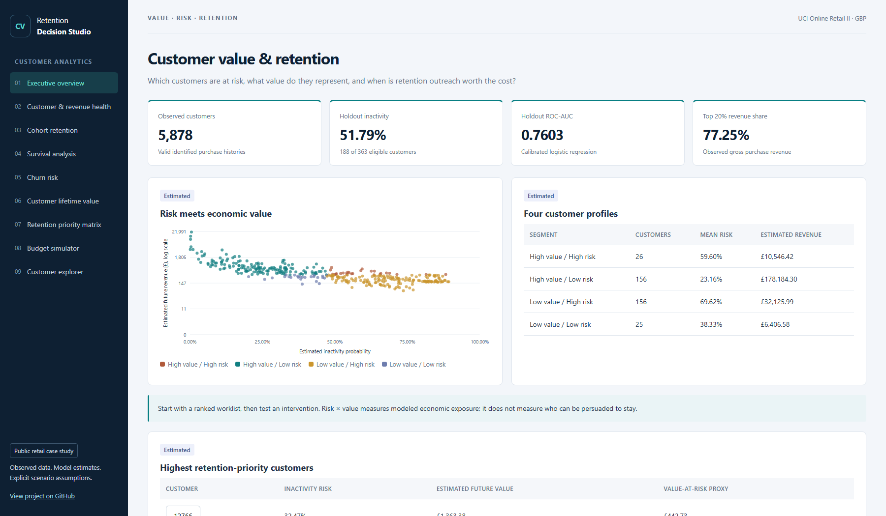
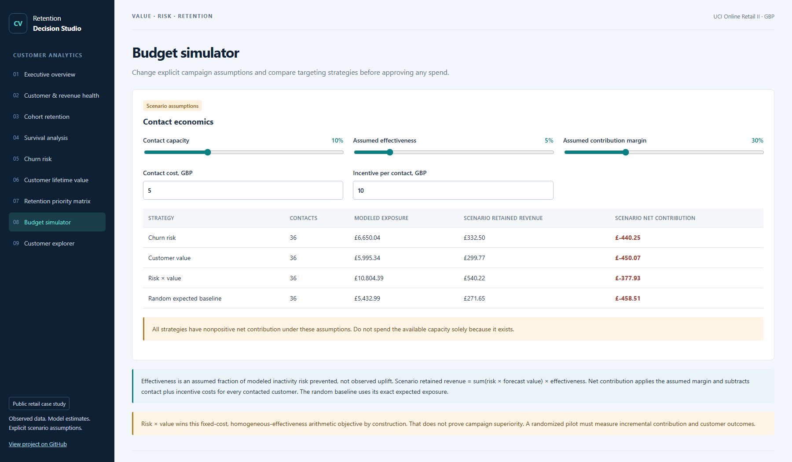
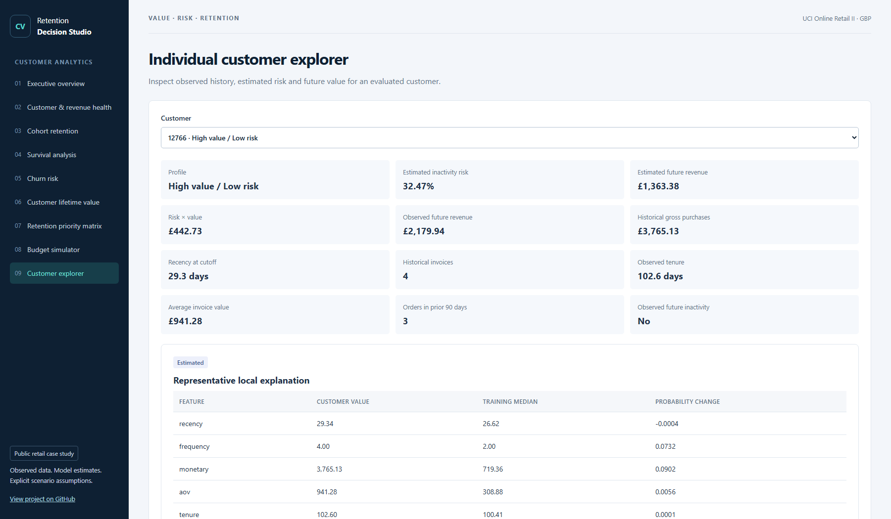

## Dashboard preview

The live dashboard connects customer inactivity risk, estimated future value, and retention decisions. These are real browser screenshots of the published dashboard's local build.

### Executive overview

<strong>View the budget simulator</strong>

Change contact capacity, assumed intervention effectiveness, margin, contact cost, and incentives. The displayed outcomes are scenarios rather than measured intervention impact.

<strong>View the individual customer explorer</strong>

Inspect an evaluated customer's observed history, estimated inactivity probability, future gross revenue, and model sensitivity explanations.

